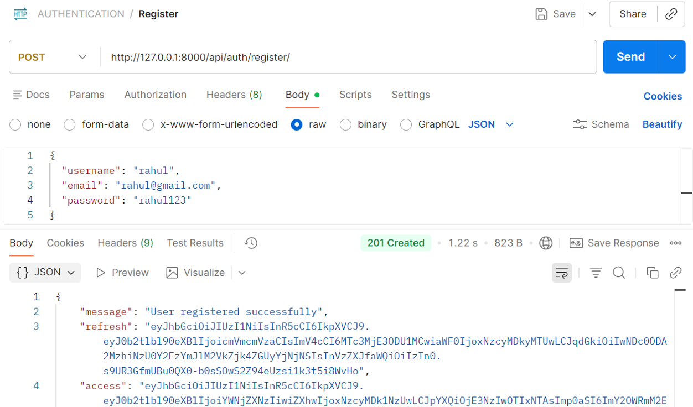
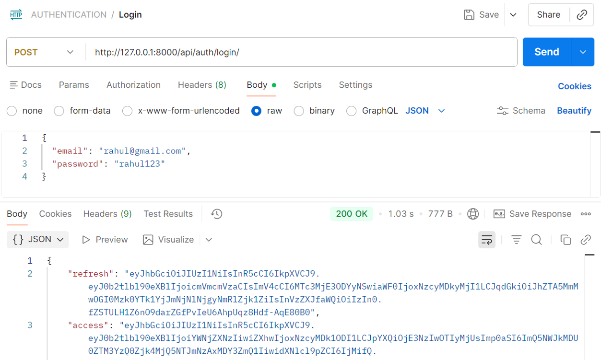
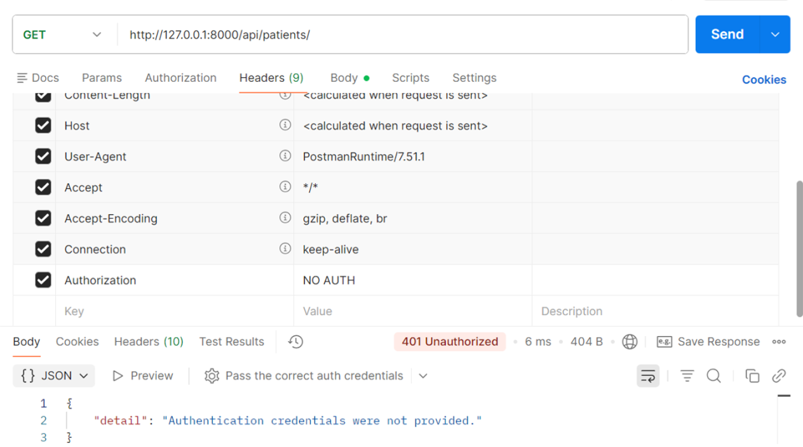
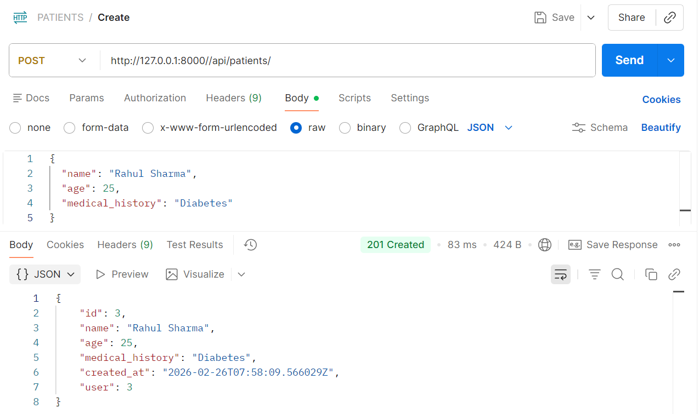
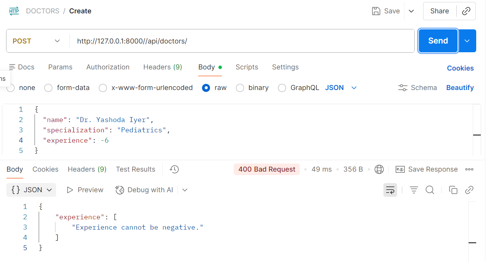
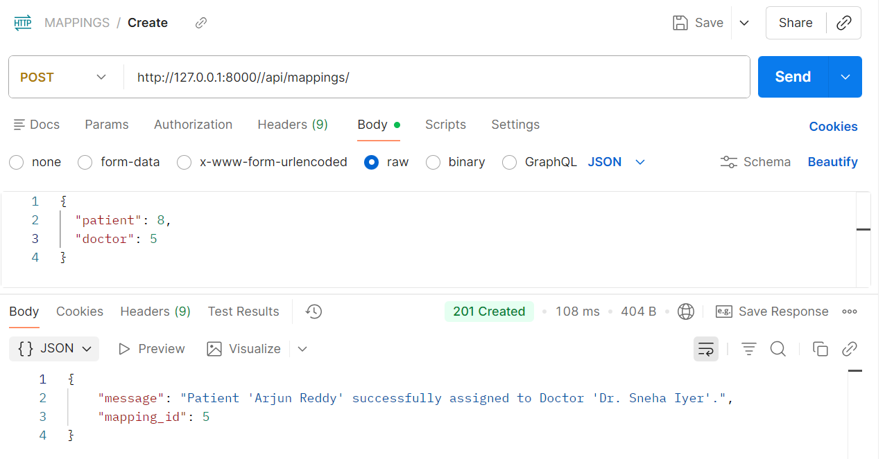
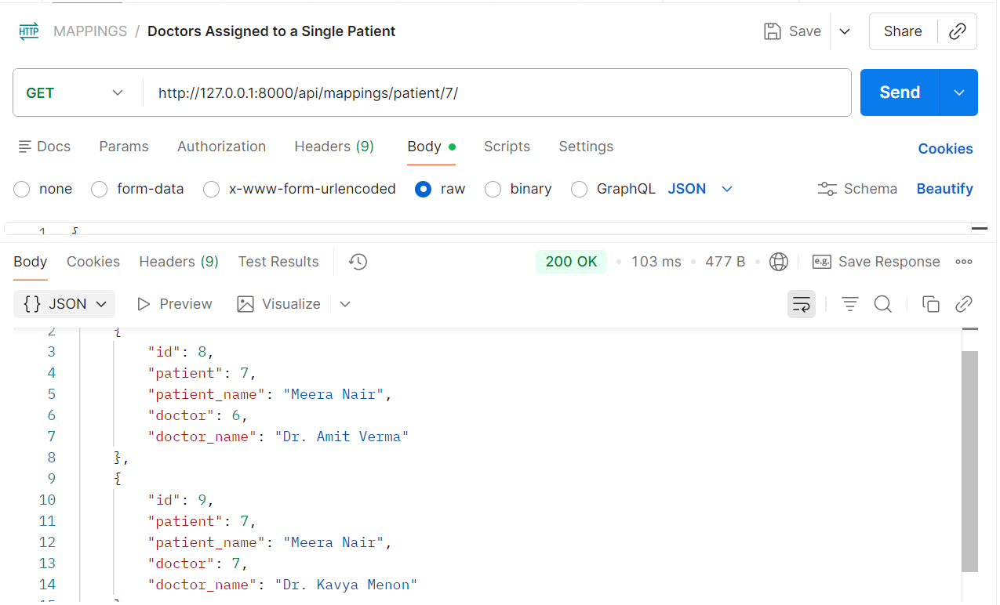
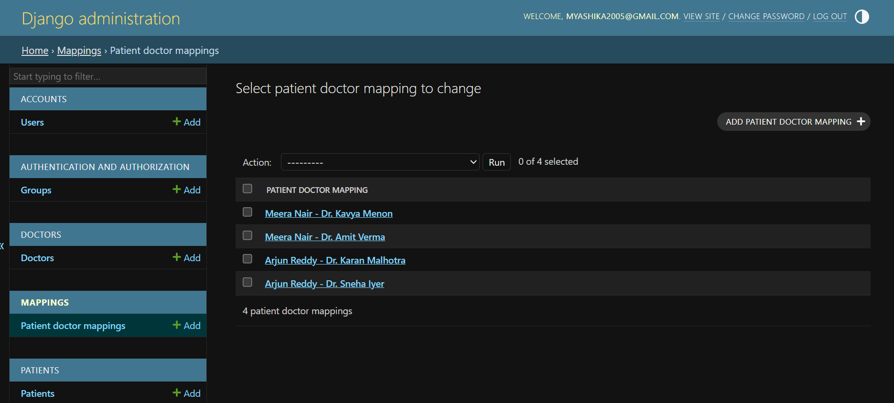

# Healthcare Backend 

## Setup Instructions

### 1. Clone the repository
```bash
git clone https://github.com/YA-shiKa/healthcare-backend
cd healthcare_backend
```

### 2. Install dependencies
```bash
pip install -r requirements.txt
```

### 3. Create a `.env` file in the project root and add:

```
SECRET_KEY=your_secret_key
DB_NAME=your_db_name
DB_USER=your_db_user
DB_PASSWORD=your_db_password
DB_HOST=localhost
DB_PORT=5432
```

### 4. Run migrations
```bash
python manage.py migrate
```

### 5. Start the server
```bash
python manage.py runserver
```
---

## Screenshots

### Register API

---
### Login API (JWT Token)

---
### Protected Endpoint (401 Unauthorized)

---
### Create Patient

---
### Create Doctor

---
### Create Mapping (Patient Assigned to Doctor)

---
### Get Doctors by Patient

---
### Django Admin Panel

---
